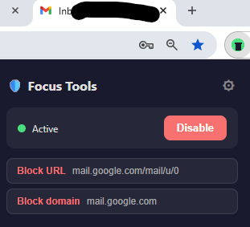
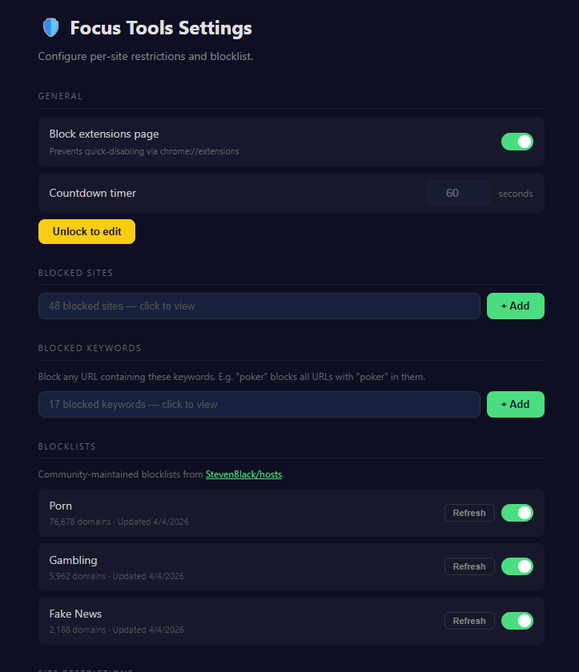
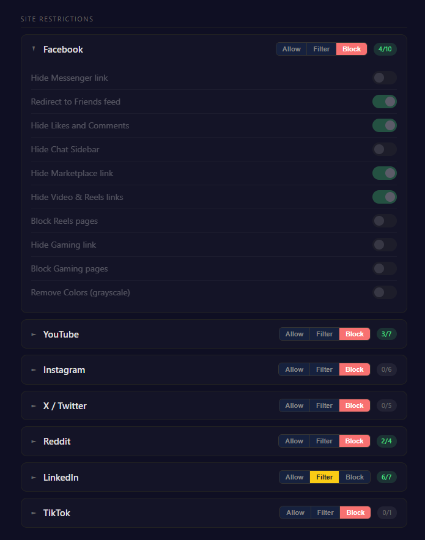
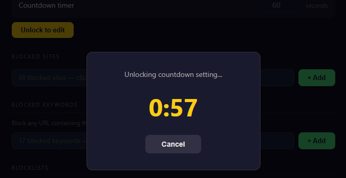

# Focus Tools

A browser extension that helps you stay focused by blocking distracting websites and hiding addictive UI elements on social media.

## Features

### Website Blocking
- **Manual blocklist** — add specific websites or URLs to block
- **Keyword blocklist** — block any URL containing specific keywords (e.g. "poker" blocks all URLs with "poker" in them)
- **Community blocklists** — one-click enable curated blocklists for porn, gambling, and fake news sites (powered by [StevenBlack/hosts](https://github.com/StevenBlack/hosts))

### Social Media Filtering
For each supported site, choose one of three modes:
- **Allow** — site works normally
- **Filter** — selectively hide distracting UI elements (feed, shorts, reels, comments, recommendations, etc.)
- **Block** — completely block access to the site

### Anti-Impulse Protection
- **Disable countdown** — configurable delay before the extension can be disabled, preventing impulsive toggling
- **Extensions page blocking** — optionally block access to `chrome://extensions` to prevent quick circumvention

### Supported Sites
| Site | Filter Options |
|------|---------------|
| Facebook | Hide Messenger, Reels, Gaming, Marketplace, Chat Sidebar, Likes/Comments. Redirect to Friends feed. Grayscale. |
| YouTube | Hide Home Feed, Shorts, Comments, Sidebar Suggestions, End Screen Cards. Block Shorts pages. Grayscale. |
| Instagram | Hide Feed, Reels, Explore, Stories. Block Reels pages. Grayscale. |
| X / Twitter | Hide Feed, Trending, Who to Follow. Block Explore page. Grayscale. |
| Reddit | Hide Feed, Popular/All links, Awards. Grayscale. |
| LinkedIn | Redirect Feed to My Network. Block Feed, Games/Puzzles. Hide Home button, News Sidebar, Notifications. Grayscale. |
| TikTok | Grayscale. |

## Browser Compatibility

Focus Tools uses **Manifest V3** and works on:
- Google Chrome
- Microsoft Edge
- Other Chromium-based browsers (Brave, Opera, Vivaldi, etc.)

> Firefox is not supported (Firefox uses a different extension API for Manifest V3).

## Installation

### From the Chrome Web Store
<!-- Coming soon -->
*Coming soon.*

### Manual Install (from source)
1. Clone or download this repository
2. Open your browser and go to `chrome://extensions` (or `edge://extensions` for Edge)
3. Enable **Developer mode** (toggle in the top-right corner)
4. Click **Load unpacked** and select the `focus-tools` folder
5. The Focus Tools icon will appear in your browser toolbar

## Usage

- **Popup** — click the Focus Tools icon in the toolbar to quickly block the current site, see extension status, or access settings
- **Options page** — right-click the icon and select "Options" (or click the settings button in the popup) to configure all features: manage your blocklist, set site modes, customize per-site filters, and adjust the disable countdown

## Contributing

Contributions are welcome! See [CONTRIBUTING.md](CONTRIBUTING.md) for guidelines.

## Privacy

Focus Tools stores all data locally on your device. No personal data is collected or transmitted. See [PRIVACY_POLICY.md](PRIVACY_POLICY.md) for details.

## License

[MIT](LICENSE)
